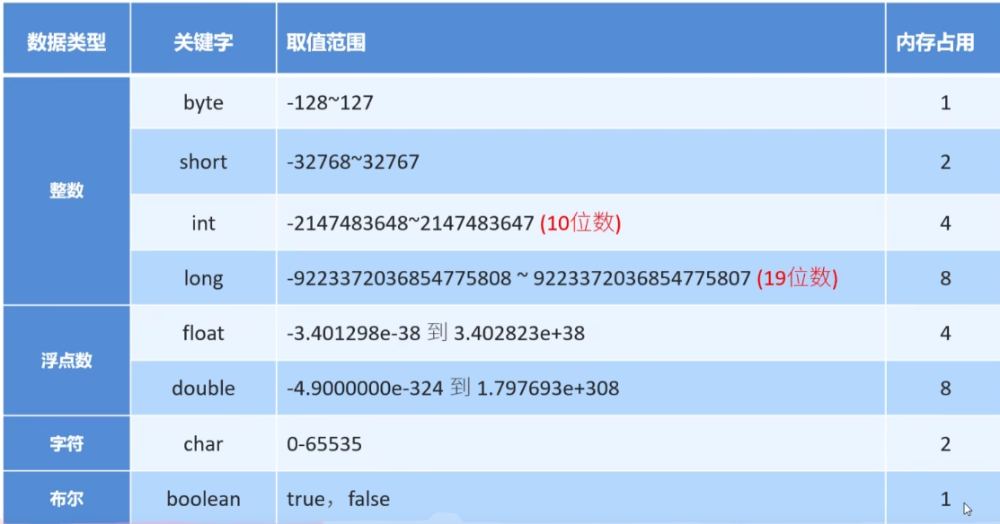

## Java

### 1. JDK是什么?有哪些内容组成?
    JDK是java开发工具包
    * JVM虚拟机: java程序运行的地方
    * 核心类库: java已经写好的东西,我们可以直接使用
    * 开发工具: javac, java, jdb, jhat...
### 2. JER是什么?有哪些内容组成?
    JRE是java运行环境
    JVM,核心类库,运行工具
### 3. JDK,JRE,JVM三者的包含关系
    * JDK包含了JRE
    * JRE包含了JVM

---------

~~~java
public class HelloWorld{
    public static void main(String[] args) {
        System.out.println('Hello World');
    }
}
~~~

-----

### \t 制表符
在打印的时候,把前面的字符串的长度补齐到8,或者8的整数倍,最少补一个空格,最多补8个空格

~~~java
public class item {
    public static void main(String[] args) {
        System.out.println("name" + '\t' + "age");
        System.out.println("tom" + '\t' + "age");
    }
}
~~~

-----------

### 变量的定义格式
1. 变量名不允许重复定义
2. 一条语句可以定义多个变量
3. 变量在使用之前一定要进行赋值
4. 变量的作用域范围
~~~markdown
数据类型 变量名 = 值;
    |     |      |
    |     |      | 
    |     |     存在空间里的数值
    |    为空间起的名字
    数据类型: 为空间中存储的数据,加入类型[限制] 整数,小数...
    int name = value; 整数
    double name = value; 小数(浮点数)
    int name = value, age = 24, gender = man;
    
~~~

-------

### 不同进制在代码中的表现形式
二进制: 以0b开通
十进制: 默认
八进制: 以0开通
十六进制: 以0x开头

#### 任意进制转十进制
    公式: 系数 * 基数的权次幂 相加

    系数: 就是每一位上的数

    基数: 当前进制数

    权: 从右往左,以此为0,1,2,3...

#### 十进制转其他进制

除基取余法

不断地除以基数(几进制,基数就是几)得到余数,直到商为0,再将余数倒着拼起来即可

### [ASCII](https://www.runoob.com/w3cnote/ascii.html)

----------

### 数据类型

### JAVA 语言的数据类型分为: 基本数据类型,引用数据类型

// 如果定义long类型的变量

// 在数值后面需要加一个l | L作为后缀

// float加F
> 整数和小数取值范围大小关系
> 
> double > float > long > int > short> byte

#### 基本数据类型和引用数据类型
##### 1. 基本数类型
* 整数类型
* 浮点数数据类型
* 布尔类型
* 字符类型
>变量中存储的是真实的数据
>
> 数据值是存储在自己的空间中
> 
> 特点: 赋值给其他变量,也是赋的真实的值
~~~java
public static void main(String[] args) {
    int number = 100;
   System.out.println(number); // 100
   change(number);
   System.out.println(number); // 100
}
// 传递基本数据类型时, 传递的是真实的数据类型, 形参的改变, 不影响实际参数的值
public static void change(int number) {
    number = 200;
}

~~~
##### 2. 引用数据类型
除了以上的全部都是
> 变量中存储的是地址值 引用: 使用了其他空间中的数据 (new)
> 
> 数据值是存储在其他空间中,自己空间中存储的是地址值
> 
> 特点: 赋值给其他变量,赋的是地址值
~~~java
public static void main(String[] args) {
    int[] array = {10, 50, 60};
   System.out.println(array[0]); // 10
   change(array);
   System.out.println(array[0]); // 1145
}
// 传递引用数据类型时, 传递的是地址值, 形参的改变, 影响实际参数的值
public static void change(int[] array) {
    array[0] = 1145;
}

~~~


### 标识符
#### 标识符的命名规则
1. 由数字,字母,_,$组成
2. 不能以数字开头
3. 不能是关键字
4. 区分大小写

### 键盘输入[Scanner]
~~~java
// 导包
import java.util.Scanner;
// 创建对象
Scanner sc = new Scanner(System.in);
// 接收数据
int num = sc.nextInt();
~~~

--------

### 算数运算符
| 符号 |    |
|----|----|
| +  | 加  |   
| -  | 减  |
| *  | 乘  |
| /  | 除  |
| %  | 取余 |

#### 数字进行运算时,数据类型不一样不能运算,需要转成一样的,才能运算

#### 类型转换的分类
1. 隐式转换
    * 取值范围小的数值
    * 取值范围大的数值
2. 强制转换
    * 取值范围大的数值
    * 取值范围小的数值

##### 隐式转换(自动类型提升)
> 把一个取值范围小的数值,转换成取值范围大的数据
> 
> byte short char 三种数据类型在运算的时候,都会直接提升为int,然后在进行运算
~~~java
int a = 10;
double b = a;
// byte > short > int > long > float > double
~~~

##### 强制转换
> 如果把一个取值范围大的数值,赋值给一个取值范围小的变量
> 
> 是不允许直接赋值的,如果一定要这么做就需要加入强制转换
> 
> 格式: 目标数据类型 变量名 = (目标数据类型) 被强制转换的数据
~~~java
double a = 11.45;
int b = (int) a;
~~~

-------------------

~~~java
// 字符 + 字符 | 字符 + 数字,会把字符通过ASCII码表查询到对应的数字在进行计算
char str1 = 'N';
char str2 = 'B';
System.out.println(str1 + str2);
~~~

### 自增自减运算符
~~~java
// ++ 加 变量的值加1
// -- 减 变量的值减1
//++,--无论是放在变量的前面还是后面,单独写一行结果是一样的
int number = 1;

/*
        参与计算
 */
int a = 10;
int b = a++;    // 先用后加

int b = ++a;    // 先加后用
~~~

### 赋值运算符
| 符号 | 作用    | 说明                    |
|----|-------|-----------------------|
| =  | 赋值    | int a = 10, 将10赋值给变量a |
| += | 加后赋值  | a+=b,将a+b的值给a         |
| -= | 减后赋值  | a-=b,将a-b的值给a         |
| *= | 乘后赋值  | a*=b,将a*b的值给a         |
| /= | 除后赋值  | a/b,将a/b的商给a          |
| %= | 取余后赋值 | a%b,将a/b的余数给a         |
>// +=, -=, *=, /=, %=底层都隐藏了一个强制类型转换

### 关系运算符(比较运算符)
| 符号  | 说明                              |
|-----|---------------------------------|
| ==  | a==b,判断a和b是否相等,成立true,不成立false  |
| !=  | a!=b,判断a和b是否不相等,成立true,不成立false |
| \>  | a>b,判断a是否大于b,成立true,不成立false    |
| \>= | a>=b,判断a是否大于等于b,成立true,不成立false |
| <   | a<b,判断a是否小于b,成立true,不成立false    |
| <=  | a<=b,判断a是否小于等于b,成立true,不成立false |

### 逻辑运算符
| 符号 | 作用   | 说明               |
|----|------|------------------|
| &  | 逻辑与  | 两边都为真,结果才是真      |
| \| | 逻辑或  | 两边都为假,结果才是假      |
| ^  | 逻辑异或 | 相同为false,不同为true |
| !  | 逻辑非  | 取反               |

### 短路逻辑运算符
| 符号   | 作用  | 说明              |
|------|-----|-----------------|
| &&   | 短路与 | 结果和&相同,但是有短路效果  |
| \|\| | 短路或 | 结果和\|相同,但是有短路效果 |  

### 三元运算符/三元表达式
> 格式: 关系表达式 ? 表达式1 : 表达式2

------------------------

### 原码,反码,补码
1. 原码
>十进制数据的二进制表现形式,最左边的是符号位,0为正,1为负
>
> 最大值 01111111 + 127
> 
> 最小值 11111111 -127

2. 反码
> 为了计算原码不能计算负数的问题而出现的
> 
> 计算规制: <正数的反码不变>,负数的反码在原码的基础上,符号位不变,0变1,1变0
3. 补码
> 为了解决负数计算时跨0的问题而出现的
> 
> 计算规则: 整数的补码不变,负数的补码在反码的基础上+1(-128, 在1个字节下,没有原码的反码)
> 
> 计算机中的存储和计算都是以补码的形式进行的

### 其他运算符

| 运算符  | 含义    | 运算规则            |
|------|-------|-----------------|
| &    | 逻辑与   | 0为false, 1为true |
| \|   | 逻辑或   | 0为false, 1为true |
| <<   | 左移    | 向左移动,低位补0       |
| \>>  | 右移    | 向右移动,高位补0或1     |
| />>> | 无符号右移 | 向右移动,高位补0       |

~~~java

public class sourceCode {
    public static void main(String[] args) {
        int a = 200;// 0000 0000 0000 0000 0000 0000 1100 1000
        int b = 10; // 0000 0000 0000 0000 0000 0000 0000 1010
        /*
        0000 0000 0000 0000 0000 0000 1100 1000 
      & 0000 0000 0000 0000 0000 0000 0000 1010 
      --------------------------------------------
        0000 0000 0000 0000 0000 0000 0000 1000
      = 8
         */
        System.out.println(a & b);

        /*
        0000 0000 0000 0000 0000 0000 1100 1000
      | 0000 0000 0000 0000 0000 0000 0000 1010
      --------------------------------------------
        0000 0000 0000 0000 0000 0000 1100 1010
       = 202
         */
        System.out.println(a | b);

        /*
      << 0000 0000 0000 0000 0000 0000 1100 1000
      --------------------------------------------
         0000 0000 0000 0000 0000 0011 0010 0000
       = 800
         */
        System.out.println(a << 2);

        /*
      >> 1111 0110
      ---------------
          1111 1101
          1111 1100
          1000 0011


        >> 0000 1010
        ---------------
           0000 0010
         */
        byte c = -10;
        System.out.println(c >> 2);

        /*
     >>> 1000 0000 0000 0000 0000 0000 0000 1010
      ---------------------------------------------
         1111 1111 1111 1111 1111 1111 1111 0101
         1111 1111 1111 1111 1111 1111 1111 0110
         0011 1111 1111 1111 1111 1111 1111 1101

         */
        int d = -10;
        System.out.println(d >>> 2);
    }
}

~~~

-----------------------

### 分支结构

#### if语句
~~~java

if (关系表达式) {
    成立执行的语句体;
} else if (关系表达式) {
    第一个关系表达式不成立执行的语句;
} else {
    都不成立执行的语句体;    
}

~~~

#### switch语句
~~~java

/*
        值依次和case后面的值进行比较,对应执行对应的代码
        都不匹配,执行default里的代码;
 */

switch (表达式) { // 取值为 byte short int char String 枚举         
    case Value1:
        code;
        break;
    case Value2:
        code;
        break;
    ...
    default:
      code;
      break;    
}

switch (表达式) {
    case Value1 -> {
        code;    
    }
    case Value2 -> 1Linecode;
    default -> {
        code;    
    }
}

~~~

-----------------------

### 循环结构

#### for循环
~~~java

for (初始化语句; 条件判断语句; 条件控制语句) {   // 无限循环 for (;;) {}
    code;
}

~~~

#### while循环
~~~java

初始化语句;
while (条件判断语句) {    // 无限循环 while (true)
    code;
    条件控制语句;
}

~~~

#### do...while循环
~~~java

初始化语句:
do {        // 无限循环 do {} while (true)
    循环体语句;  
    条件控制语句

} while (条件判断语句);

~~~

#### continue break
~~~java

while (true) {
    continue; // 跳过本次循环
    break;  // 结束循环
}

~~~

-----------------------

### 获取随机数
~~~java
// 导包
import java.util.Random;
// 创建对象
Random random = new Random();
// 生成随机数
int number = random.nextInt(随机数范围); // 一个默认从 0 开始, 0-10 包括 0 但不包括 10
~~~

### 数组
* 数组指的是一种容器,可以用来存储同种数据类型的多个值
#### 定义数组
~~~java
数据类型 [] 数组名
int [] array

数据类型 数组名[]
int array[]

~~~
#### 数组的初始化
~~~java
/*
        初始化: 就是在内存中,为数组容器开辟空间,并将数据存入容器中的过程
 */
// 静态初始化
数据类型 [] 数组名 = new 数据类型[] {element1, element2,...};
// 简化 数据类型 [] 数组名 = {element};

// 动态初始化
// 初始化时只指定数组长度,由系统为数组分配初始值
数据类型[] 数组名 = new 数据类型[数组长度];
/*
        数组默认初始化值
        整数类型: 默认值0
        小数类型: 默认0.0
        字符数据类型: 默认'/u0000' 空格
        布尔类型: 默认false
        引用数据类型: 默认null
 */
~~~
### 数组元素访问
~~~java

数组名[下标 | 索引]

~~~
### 遍历数组
~~~java

int[] arr = {1, 2, 3, 4, 5};
for (int i = 0; i < arr.length; i++) {
    System.out.println(arr[i]);
}

~~~

### 二维数组
#### 二维数组的初始化
~~~java
/*
        静态初始化
*/
// 格式
数据类型[][] 数组名 = new 数据类型[][] {{element1, element2}, {element1, element2}};
// 简化格式
数据类型[][] 数组名 = {{element1, element2}, {element1, element2}};

/*
        动态初始化
 */
// 格式
数据类型[][] 数组名 = new 数据类型[m][n];
// m表示这个二维数组,可以存放多少个一维数组
// n表示每一个一维数组,可以存放多少个元素

~~~

------------------

### Java内存分配
* 栈 &emsp; &emsp; &emsp; &emsp; &emsp; &emsp; 方法运行时使用的内存,比如main方法,进入方法栈中执行
* 堆 &emsp; &emsp; &emsp; &emsp; &emsp; &emsp; 存储对象或者数组,new来创建,都存储在堆内存
* 方法区 &emsp; &emsp; &emsp; &emsp; &nbsp;存储可以运行的class文件
* 本地方法栈 &emsp; &emsp; &emsp;JVM在使用操作系统功能的时候使用,和我们开发无关
* 寄存器 &emsp; &emsp; &emsp; &emsp; &nbsp;给CPU使用,和我们开发无关

----------------

### 方法
> 方法(method)是程序中最小的执行单元
~~~java
/* 
    方法定义
*/
// 最简单的方法定义
public static void methodName() {
    code;
}
// 带参数的方法定义
public static void calc(int args1, int args2) {
    code;
}
/*
        形参和实参
 */
// 形参: 全程形式参数,是指方法`定义`中的参数
// 实参: 全程实际参数,方法`调用`中的参数

// 带返回值的方法定义
public static 返回值类型 methodName(args) {
    code;
    return 返回值;
}

// 方法调用 必须先定义在调用
methodName(); 
/*
        方法的内存
 */
// 方法调用的基本原理 -> 方法 进栈执行 先进后出


~~~

> Ctrl + Alt + T(包围), Ctrl + Alt + M(抽取方法)

### 方法的重载
* 在同一个类中,定义了多个同名的方法,这些同名的方法具有同种功能
* 每个方法具有不同的参数类型或参数个数,这些同名方法,就构成了重载关系
>参数不同,类型不同,个数不同,顺序不同
 
 ---------

## 面向对象

 * 面向: 拿,找
 * 对象: 能干活的东西
 * 面向对象编程: 拿东西过来做对应的事情

### 类和对象
* 类(设计图): 是对象共同特征的描述;
* 对象: 是真实存在的具体东西
~~~java
// 如何定义类
public class Phone {
    1. 成员变量 (代表属性, 一般是名词)
    2. 成员方法 (代表行为, 一般是动词)
    3. 构造器
    4. 代码块
    5. 内部类
    
    String brand;
    duoble price;
    
    public void call() {
        
    }
    public void playGame() {
        
    }
    // 得到类对象
    类名 对象名 = new 类名();
    Phone phone = new Phone();
    // 使用对象
    * 访问属性: 对象名.成员变量
    * 访问行为: 对象名.方法名(...)
    
/*
        用来描述一类事物的类,专业叫做: javabean类
        在javabean类中,写的不是main方法
        
        编写main方法的类,叫做测试类
        我们可以在测试类中创建javabean类的对象并进行赋值调用
        
        定义首字母建议大写,需要见名知意,驼峰命名
        一个java文件中可以定义多个class类,且只能一个类是public装饰,而且public修饰的类名必须成为代码文件名
        建议一个文件定义一个class类
        成员变量的完整定义格式: 修饰符 数据类型 变量名称 = 初始化值; 一般无需指定初始化值,存在默认值
        
 */
}

~~~
#### 对象的成员变量的默认规则

<table>
<thead>
<tr>
<th>数据类型</th>
<th>明细</th>
<th>默认值</th>
</tr>
<tr>
<td rowspan="4">基本类型</td>
</tr>
<td>byte,short,int,long</td>
<td>0</td>
<tr>
<td>float,double</td>
<td>0.0</td>
</tr>
<tr>
<td>boolean</td>
<td>false</td>
</tr>
<tr>
<td>引用类型</td>
<td>类,接口,数组,String</td>
<td>null</td>
</tr>
</thead>
</table>

### 封装
>对象代表什么,就得封装对应的数据,并提供数据对应的行为

### private关键字
* 是一个权限修饰符
* 可以修饰成员(成员变量和成员方法)
* 被private修饰的成员只能在本类中才能访问

### this关键字

作用: 区分成员变量和局部变量
本质: 代表方法调用者的地址值

### 构造方法

> 构造方法也叫构造器,构造函数
> 作用: 在创建对象的时候给成员变量进行初始化的
> 
~~~java
// 格式
public class Student {
    修饰符 类名(参数) {
        方法体;
    }
}
/*
        1.方法名与类名相同,大小写也要一致
        2.没有返回值类型,连void也没
        3.没有具体的返回值(不能由return带回结果数据)
 */
/*
        alt + insert
 */

//执行时机:
//1.创建对象的时候由虚拟机调用,不能手动调用构造方法
//2.每创建一次对象,就会调用一次构造方法
~~~

### 标准的javaBean类
1. 类名需要见名知意
2. 成员变量使用private修饰
3. 提供至少两个构造方法
   * 无参构造方法
   * 带全部参数的构造方法
4. 成员方法
   * 提供每一个成员变量对应的setXxx()/getXxx()
   * 如果还有其他行为,也需要写上

-----

## 创建String对象的两种方式
~~~java
// 直接赋值 进字符串池
String name = "Hello World";
// new 构造方法 进堆
public String(); // 创建空白字符串,不含任何内容
public String(String original); // 根据传入的字符串,创建字符串对象
public String(char[] chs); // 根据字符数组,创建字符串对象
public String(byte[] byt); // 根据字节数组,创建字符串对象

// 转换为字符串对象
public static String valueOf(boolean b)
public static String valueOf(char c)
public static String valueOf(int i)
public static String valueOf(long l)
public static String valueOf(float f)
public static String valueOf(double d)
public static String valueOf(char[] data)
public static String valueOf(Object obj)

~~~

## 字符串的比较
~~~java
String s1 = "abc";
String s2 = new String("abc");
System.out.println(s1 == s2); // 输出false
// ==
/*
基本数据类型 比较的是具体的值
引用数据类型 比较的是内存地址
*/
boolean equals方法(要比较的字符串) 完全一样结果true
boolean equalslgnoreCase(要比较的字符串) 忽略大小写的比较
~~~
## 截取字符串
~~~java
String substring(int beginIndex, int endIndex) // 截取 包头不包尾
String substring(int beginIndex) // 截取到末尾
~~~
## 替换字符
~~~java
String replace(旧值, 新值) // 替换
~~~
### StringBuilder
> StringBuilder可以看作一个容器,创建之后里面的内容是可变的
> 打印对象是属性值不是地址值
~~~java
StringBuilder构造方法
public StringBuilder() // 创建一个空白可变的字符串对象,不含有任何内容
public StringBuilder(String str) // 根据字符串的内容,来创建可变字符串
// 方法
append(任意类型) // 添加数据
reverse()       // 反转容器中的内容
length()        // 返回长度
toString()      // 把StringBuilder转为String
~~~
### StringJoiner
> StringJoiner和StringBuilder可以看作一个容器,创建之后里面的内容是可变的
~~~java
StringJoiner(间隔符号) // 创建一个StringJoiner对象,指定拼接的间隔符号
StringJoiner(间隔符号, 开始符号, 结束符号) // 创建一个StringJoiner对象, 指定拼接的间隔符号, 开始符号, 结束符号
// 方法
add(添加的内容)  // 添加数据
length()        // 返回长度
toString()      // 返回一个字符串, 拼接之后的值
~~~
### 字符串底层原理
#### 存储的内存原理
>* 直接赋值会复用字符串常量池中的
>* new出来的不会复用,而是开辟一个新的空间
#### ==比较的是什么
>* 基本数据类型比较数据值
>* 引用数据类型比较地址值
#### 字符串拼接的底层原理
>* 如果没有变量参加,都是字符串直接相加,编译之后就是拼接之后的结果,会复用串池中的字符串
>* 如果有变量参加,会创建新的字符串,浪费内存
#### StringBuilder提高效率的原理
>* 所有要拼接的内容都会往StringBuilder中放,不会创建很多无用的空间,节约内存
>* 默认创建一个长度为16的字节数组
>* 添加的内容长度小于16,直接存
>* 添加的内容大于16会扩容(原来的容量*2+2)
>* 如果扩容的长度还不够,以实际的长度为准

## 集合
### ArrayList
~~~java
boolean add(E e) // 添加元素, 返回值表示是否添加成功
boolean remove(E e) // 删除指定元素, 返回值表示是否删除成功
E remove(int index) // 删除指定索引的元素,返回被删除的元素
E set(int index, E e) // 修改执行下标的元素,返回原来的元素
E get(int index) // 获取指定索引的元素
int size() // 集合的长度,也就是集合中元素的个数
~~~
### 基本数据类型对应的包装类
```java
byte -> Byte

short -> Short

char -> Character

int -> Integer

long -> Long

float -> Float

double -> Double

boolean -> Boolean
```

## 面向对象
### static
* static表示静态,是java中的一个修饰符,可以修饰成员方法,成员变量
  * 被static修饰的成员变量,叫做静态变量
  > 特点: 
    > 
    > 被该类所有对象共享
    > 
    > 不属于对象,属于类
    > 
    > 随着类的加载而加载,优先于对象存在

  >调用方法:
    > 
    > 类名调用
    >
    > 对象名调用
    
  * 被static修饰的成员方法,叫做静态方法
  > 特点:
    > 多用在测试类和工具类中
    >
    > javabean类中很少会用

  > 调用方法:
    > 
    > 类名调用
    >
    > 对象名调用

#### 类
> javabean类     用来描述一类事物的类, 比如, Student, Dog...
> 
> 测试类         用来检查其他类是否书写正确, 带有main方法的类, 是程序的入口
> 
> 工具类         不是用来描述的一类事物, 而是帮我们做的一些事情的类

#### 工具类
1. 类名见名知意
2. 私有化构造方法
3. 方法定义为静态

### static的注意事项
* 静态方法`只能`访问静态变量和静态方法
* 非静态方法`可以`访问静态变量或者静态方法,`也可以`访问非静态的成员变量和非静态的成员方法
* 静态方法中没有this关键字

## 继承
* java中提供了一个关键字extends,用这个关键字,我们可以让一个类和另一个类建立器继承关系

    public class Student extends Person {}

* Student称之为子类,Person成为父类

>当类与类之间,存在相同(共性)的内容, 并满足子类是父类中的一种,就可以考虑使用继承

### java只支持但继承,不支持多继承,但支持多层继承
* 单继承: 一个子类只能继承一个父类
* 不支持多继承: 一个字不能继承多个父类
* 多层继承: 子类A继承父类B, 父类B可以继承父类C
* 每一个类都直接或者简介的继承Object

## 继承
```
构造方法    非私有(不能继承)    private(不能继承)
 
成员变量   非私有(能)          private(能) 但是不能用(能通过get,set)
 
成员方法   需方法表(能)        否则(不能)  
只有父类中的虚方法才能被子类继承(非private,static,final)
```

### 继承中: 成员变量的访问特点
* 就近原则: 谁离我近,我就用谁

### 方法的重写
* 当父类的方法不能满足子类现在的需求时,需要进行方法重写
### 书写格式
* 在继承体系中,子类出现了和父类中一模一样的方法声明,我们就称子类这个方法是重写的方法
### @Override重写注释
1. @override是放在重写后的方法上,校验子类重写时语法是否正确
2. 加上注释后如果有红色波浪线,表示语法错误
### 方法重写的注意事项和要求
1. 重写方法的名称,形参列表必须与父类中的一致
2. 子类重写父类方法时,访问权限子类必须大于等于父类(空着不写<protected<public)
3. 子类重写父类方法时,返回值类型必须小于等于父类
4. 只有被添加到虚方法表中的方法才能被重写
### 构造方法的访问特点
* 父类中的构造方法不会被子类继承
* 子类中所有的构造方法默认先访问父类中的无参构造,在执行自己
* 子类构造方法的第一行语句默认都是: super(), 不写默认存在,且必须在第一行
* 如果想调用父类有参构造,必须手动写super进行调用

## 多态
* 同种类型的对象,表现出不同的形态
### 多态的表现形式
* 父类类型 对象名称 = 子类对象;
### 多态的前提
* 有继承关系
* 有父类引用指向子类对象
* 有方法重写

## 多态调用成员的特点
* 变量调用: 编译看左边,运行也看左边
* 方法调用: 编译看左边,运行看右边

## 多态的优势
* 在多态形式下,右边对象可以实现解耦和,便于拓展和维护
* 定义一个方法的时候,使用父类型作为参数,可以接受所有子类对象,体现多态的拓展性与便利

## 包
* 包就是文件夹,用来管理各种不同功能的Java类,方便后期代码维护
* 包名的规则: 公式域名反写 + 包的作用, 需要全部英文小写, 见名知意
### 使用其他类的规则
* 使用同一个包中的类时,不需要导包
* 使用java.lang包中的类时,不需要导包
* 其他情况都需要导包
* 如果同时使用两个包中的同名类,需要使用全类名

## final
```java
方法       表明该方法是最终方法,不能被重写
类         表明该类是最终类,不能被继承
变量       叫做常量,只能被赋值一次
// final修饰的是基本类型,那么存储的数据值不能发生改变
// final修饰的是引用类型,那么变量存储的地址值不能发生改变,对象内部的可以改变
```
## 常量
#### 常量的命名规范
* 单个单词: 全部大写
* 多个单词: 全部大写,单词之间用下划线隔开
## 权限修饰符的分类
* 有四种作用范围由小到大(private<空着不写(缺省/默认)<protected<public)

|    修饰符    | 同一个类中 | 同一个包中其他类 | 不同包下的子类 | 不同包下的无关类 |
|:---------:|:-----:|:--------:|:-------:|:--------:|
|  private  |   ✔   |          |         |          |
|   空着不写    |   ✔   |    ✔     |         |          |
| protected |   ✔   |    ✔     |    ✔    |          |
|  public   |   ✔   |    ✔     |    ✔    |    ✔     |

## 抽象类
* 抽取共性时,无法确定方法体,就把方法定义为抽象的
* 强制让子类按照某种格式重写
* 抽象方法所在的类,必须是抽象类
### 抽象类和抽象方法的格式
```java
public abstract 返回值类型 方法名(参数);
public abstract class 类名{}
```
### 继承抽象类
* 要么重写抽象类中的所有方法
* 要么是抽象类

## 接口
### 接口的定义和使用
```java
// 用interface关键字来定义
public interface 接口名 {}
// 接口不能实例化
// 接口和类之间是实现关系,通过 implements 关键字表示
public class 类名 implements 接口名 {}
/*
    接口的子类(实现类)
    // 要么重写接口中所有抽象方法
    // 要么是抽象类
*/

// 接口和类的实现关系,可以单实现,也可以多实现
public class 类名 implements 接口1, 接口2 {}
// 实现类还可以在继承一个类的同时实现多个接口
public class 类名 extends 父类 implements 接口1, 接口2 {}
```
### 接口中成员的特点
* 成员变量
  * 只能是常量
  * 默认修饰符: public static final
* 构造方法
  * 无
* 成员方法
  * 只能是抽象方法
  * 默认修饰符: public abstract
  * JDK7以前: 接口中只能定义抽象方法
  * JDK8: 接口中可以定义有方法体的方法
  * JDK9: 接口中可以定义私有方法

### JDK8以后接口中新增的方法
* 允许在接口中定义默认方法,需要使用关键字default修饰
  * 作用: 解决接口升级的问题
接口中`默认方法`的定义格式:
```java
public default void test() {}
```
* 默认方法不是抽象方法,所以不强制重写,但是如果被重写,重写的时候去掉default关键字
* public可以省略,defaule不能
* 如果实现多个接口,多个接口中存在相同名字的默认方法,子类就必须对该方法进行重写

---

* 允许在接口中定义静态方法,需要用static修饰
接口中`静态方法`的定义格式:
```java
public static void test() {}
```
* 静态方法只能通过接口名调用,不能通过实现类名或者对象名调用


