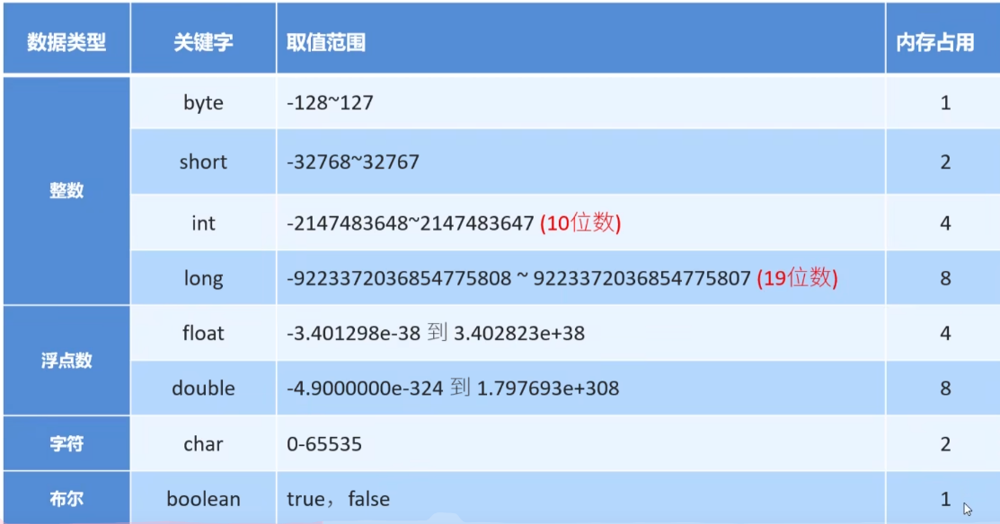

## Java

### 1. JDK是什么?有哪些内容组成?
    JDK是java开发工具包
    * JVM虚拟机: java程序运行的地方
    * 核心类库: java已经写好的东西,我们可以直接使用
    * 开发工具: javac, java, jdb, jhat...
### 2. JER是什么?有哪些内容组成?
    JRE是java运行环境
    JVM,核心类库,运行工具
### 3. JDK,JRE,JVM三者的包含关系
    * JDK包含了JRE
    * JRE包含了JVM

---------

~~~java
public class HelloWorld{
    public static void main(String[] args) {
        System.out.println('Hello World');
    }
}
~~~

-----

### \t 制表符
在打印的时候,把前面的字符串的长度补齐到8,或者8的整数倍,最少补一个空格,最多补8个空格

~~~java
public class item {
    public static void main(String[] args) {
        System.out.println("name" + '\t' + "age");
        System.out.println("tom" + '\t' + "age");
    }
}
~~~

-----------

### 变量的定义格式
1. 变量名不允许重复定义
2. 一条语句可以定义多个变量
3. 变量在使用之前一定要进行赋值
4. 变量的作用域范围
~~~markdown
数据类型 变量名 = 值;
    |     |      |
    |     |      | 
    |     |     存在空间里的数值
    |    为空间起的名字
    数据类型: 为空间中存储的数据,加入类型[限制] 整数,小数...
    int name = value; 整数
    double name = value; 小数(浮点数)
    int name = value, age = 24, gender = man;
    
~~~

-------

### 不同进制在代码中的表现形式
二进制: 以0b开通
十进制: 默认
八进制: 以0开通
十六进制: 以0x开头

#### 任意进制转十进制
    公式: 系数 * 基数的权次幂 相加

    系数: 就是每一位上的数

    基数: 当前进制数

    权: 从右往左,以此为0,1,2,3...

#### 十进制转其他进制

除基取余法

不断地除以基数(几进制,基数就是几)得到余数,直到商为0,再将余数倒着拼起来即可

### [ASCII](https://www.runoob.com/w3cnote/ascii.html)

----------

### 数据类型

### JAVA 语言的数据类型分为: 基本数据类型,引用数据类型

// 如果定义long类型的变量

// 在数值后面需要加一个l | L作为后缀

// float加F
> 整数和小数取值范围大小关系
> 
> double > float > long > int > short> byte

### 标识符
#### 标识符的命名规则
1. 由数字,字母,_,$组成
2. 不能以数字开头
3. 不能是关键字
4. 区分大小写

### 键盘输入[Scanner]
~~~java
// 导包
import java.util.Scanner;
// 创建对象
Scanner sc = new Scanner(System.in);
// 接收数据
int num = sc.nextInt();
~~~

--------

### 算数运算符
| 符号 |    |
|----|----|
| +  | 加  |   
| -  | 减  |
| *  | 乘  |
| /  | 除  |
| %  | 取余 |

#### 数字进行运算时,数据类型不一样不能运算,需要转成一样的,才能运算

#### 类型转换的分类
1. 隐式转换
    * 取值范围小的数值
    * 取值范围大的数值
2. 强制转换
    * 取值范围大的数值
    * 取值范围小的数值

##### 隐式转换(自动类型提升)
> 把一个取值范围小的数值,转换成取值范围大的数据
> 
> byte short char 三种数据类型在运算的时候,都会直接提升为int,然后在进行运算
~~~java
int a = 10;
double b = a;
// byte > short > int > long > float > double
~~~

##### 强制转换
> 如果把一个取值范围大的数值,赋值给一个取值范围小的变量
> 
> 是不允许直接赋值的,如果一定要这么做就需要加入强制转换
> 
> 格式: 目标数据类型 变量名 = (目标数据类型) 被强制转换的数据
~~~java
double a = 11.45;
int b = (int) a;
~~~

~~~java
// 字符 + 字符 | 字符 + 数字,会把字符通过ASCII码表查询到对应的数字在进行计算
char str1 = 'N';
char str2 = 'B';
System.out.println(str1 + str2);
~~~

### 自增自减运算符
~~~java
// ++ 加 变量的值加1
// -- 减 变量的值减1
//++,--无论是放在变量的前面还是后面,单独写一行结果是一样的
int number = 1;

/*
        参与计算
 */
int a = 10;
int b = a++;    // 先用后加

int b = ++a;    // 先加后用
~~~

### 赋值运算符
| 符号 | 作用    | 说明                    |
|----|-------|-----------------------|
| =  | 赋值    | int a = 10, 将10赋值给变量a |
| += | 加后赋值  | a+=b,将a+b的值给a         |
| -= | 减后赋值  | a-=b,将a-b的值给a         |
| *= | 乘后赋值  | a*=b,将a*b的值给a         |
| /= | 除后赋值  | a/b,将a/b的商给a          |
| %= | 取余后赋值 | a%b,将a/b的余数给a         |
>// +=, -=, *=, /=, %=底层都隐藏了一个强制类型转换

### 关系运算符(比较运算符)
| 符号  | 说明                              |
|-----|---------------------------------|
| ==  | a==b,判断a和b是否相等,成立true,不成立false  |
| !=  | a!=b,判断a和b是否不相等,成立true,不成立false |
| \>  | a>b,判断a是否大于b,成立true,不成立false    |
| \>= | a>=b,判断a是否大于等于b,成立true,不成立false |
| <   | a<b,判断a是否小于b,成立true,不成立false    |
| <=  | a<=b,判断a是否小于等于b,成立true,不成立false |

### 逻辑运算符
| 符号 | 作用   | 说明               |
|----|------|------------------|
| &  | 逻辑与  | 两边都为真,结果才是真      |
| \| | 逻辑或  | 两边都为假,结果才是假      |
| ^  | 逻辑异或 | 相同为false,不同为true |
| !  | 逻辑非  | 取反               |

### 短路逻辑运算符
| 符号   | 作用  | 说明              |
|------|-----|-----------------|
| &&   | 短路与 | 结果和&相同,但是有短路效果  |
| \|\| | 短路或 | 结果和\|相同,但是有短路效果 |  

### 三元运算符/三元表达式
> 格式: 关系表达式 ? 表达式1 : 表达式2

### 原码,反码,补码
1. 原码
>十进制数据的二进制表现形式,最左边的是符号位,0为正,1为负
>
> 最大值 01111111 + 127
> 
> 最小值 11111111 -127

2. 反码
> 为了计算原码不能计算负数的问题而出现的
> 
> 计算规制: <正数的反码不变>,负数的反码在原码的基础上,符号位不变,0变1,1变0
3. 补码
> 为了解决负数计算时跨0的问题而出现的
> 
> 计算规则: 整数的补码不变,负数的补码在反码的基础上+1(-128, 在1个字节下,没有原码的反码)
> 
> 计算机中的存储和计算都是以补码的形式进行的

### 其他运算符

| 运算符  | 含义    | 运算规则            |
|------|-------|-----------------|
| &    | 逻辑与   | 0为false, 1为true |
| \|   | 逻辑或   | 0为false, 1为true |
| <<   | 左移    | 向左移动,低位补0       |
| \>>  | 右移    | 向右移动,高位补0或1     |
| />>> | 无符号右移 | 向右移动,高位补0       |

~~~java

public class sourceCode {
    public static void main(String[] args) {
        int a = 200;// 0000 0000 0000 0000 0000 0000 1100 1000
        int b = 10; // 0000 0000 0000 0000 0000 0000 0000 1010
        /*
        0000 0000 0000 0000 0000 0000 1100 1000 
      & 0000 0000 0000 0000 0000 0000 0000 1010 
      --------------------------------------------
        0000 0000 0000 0000 0000 0000 0000 1000
      = 8
         */
        System.out.println(a & b);

        /*
        0000 0000 0000 0000 0000 0000 1100 1000
      | 0000 0000 0000 0000 0000 0000 0000 1010
      --------------------------------------------
        0000 0000 0000 0000 0000 0000 1100 1010
       = 202
         */
        System.out.println(a | b);

        /*
      << 0000 0000 0000 0000 0000 0000 1100 1000
      --------------------------------------------
         0000 0000 0000 0000 0000 0011 0010 0000
       = 800
         */
        System.out.println(a << 2);

        /*
      >> 1111 0110
      ---------------
          1111 1101
          1111 1100
          1000 0011

        >> 0000 1010
        ---------------
           0000 0010
         */
        byte c = -10;
        System.out.println(c >> 2);

        /*
     >>> 1000 0000 0000 0000 0000 0000 0000 1010
      ---------------------------------------------
         1111 1111 1111 1111 1111 1111 1111 0101
         1111 1111 1111 1111 1111 1111 1111 0110
         0011 1111 1111 1111 1111 1111 1111 1101

         */
        int d = -10;
        System.out.println(d >>> 2);
    }
}

~~~

### 分支语句

#### if语句
~~~java

if (关系表达式) {
    成立执行的语句体;
} else if (关系表达式) {
    第一个关系表达式不成立执行的语句;
} else {
    都不成立执行的语句体;    
}

~~~

#### switch语句
~~~java

/*
        值依次和case后面的值进行比较,对应执行对应的代码
        都不匹配,执行default里的代码;
 */

switch (表达式) { // 取值为 byte short int char String 枚举         
    case Value1:
        code;
        break;
    case Value2:
        code;
        break;
    ...
    default:
      code;
      break;    
}

switch (表达式) {
    case Value1 -> {
        code;    
    }
    case Value2 -> 1Linecode;
    default -> {
        code;    
    }
}

~~~